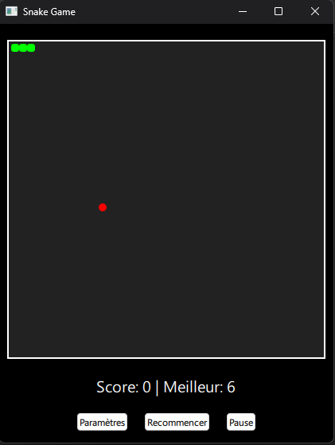
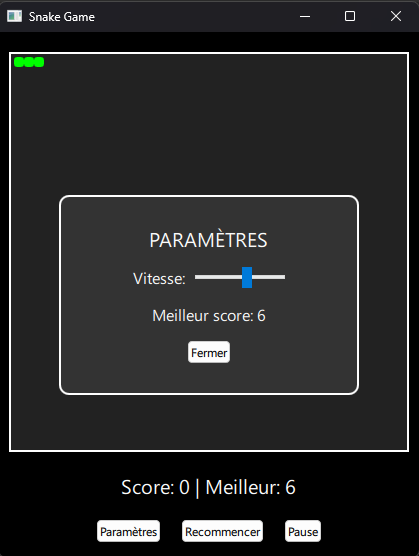

# 🐍 Snake Game

Un jeu Snake classique implémenté avec Qt Quick (QML) et C++, avec des fonctionnalités modernes.



## ✨ Fonctionnalités

- **Jeu Snake traditionnel** avec mécaniques classiques
- **3 niveaux de difficulté** ajustables (vitesse du serpent)
- **Système de score** avec meilleur score persistant
- **Contrôles intuitifs** : clavier ou boutons à l'écran
- **Mode pause** avec reprise possible
- **Interface moderne** avec QML
- **Paramètres configurables** en jeu

## 🛠 Technologies utilisées

- Qt 6
- QML pour l'interface
- C++ pour la logique du jeu
- QSettings pour la persistance des scores

## 📦 Structure du projet

```
snake-game-qt/
├── CMakeLists.txt       # Fichier de configuration CMake
├── main.cpp             # Point d'entrée de l'application
├── snake.h              # Classe principale du jeu (header)
├── snake.cpp            # Implémentation de la logique du jeu
|── main.qml             # Interface utilisateur QML
```

### Compilation
1. Clonez le repository :
   ```bash
   git clone https://github.com/Bilel-BenTaher/Snake-app.git
   cd snake-app
   ```

2. Créez un dossier build et compilez :
   ```bash
   mkdir build && cd build
   cmake ..
   make
   ```

3. Lancez l'application :
   ```bash
   ./SnakeGame
   ```

   *Ou ouvrez le projet avec Qt Creator et lancez-le depuis l'IDE.*

## 🎮 Comment jouer

### Contrôles
- **Flèches directionnelles** : Déplacer le serpent
- **Espace** : Démarrer/Recommencer le jeu
- **P** : Mettre en pause/Reprendre
- **Boutons à l'écran** :
  - **Paramètres** : Ajuster la vitesse du jeu
  - **Pause/Reprendre** : Contrôler l'état du jeu
  - **Nouvelle Partie/Rejouer** : Recommencer

### Règles
1. Mangez la nourriture (carré rouge) pour grandir et marquer des points
2. Évitez les murs et votre propre corps
3. Le jeu s'accélère au fur et à mesure que vous progressez

---

*© 2024 Bilel BEN TAHER*
